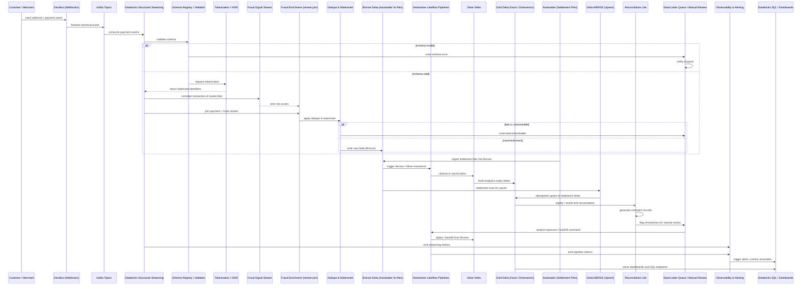

### Full Atomic Diagram


### Atomic Steps
Event emitted → Kafka topic (Source A/B) → Kafka consumer (Structured Streaming) → Schema validation → Tokenization/Masking → Stream join (fraud enrichment) → Dedupe & watermark handling → Write to Bronze Delta → Silver processing (canonicalization) → Gold aggregation (facts/dimensions) → Settlement batch ingestion → MERGE into Gold → Reconciliation job → Alerts / Dashboards.

### Conceptual pipeline(s)
```yaml
lakeflowPipeline:
  name: payment-gateway-platform
  description: >
    End-to-end Declarative Lakeflow pipeline for Payment Gateway analytics:
    ZeroBus webhooks + fraud stream + settlement batch → Bronze/Silver/Gold →
    reconciliation → alerts/dashboards.

  settings:
    compute:
      mode: jobs
      clusterPolicy: payment-gateway-policy
      autoscale:
        minWorkers: 2
        maxWorkers: 16
    checkpointsBasePath: /mnt/payment/checkpoints
    defaultWarehouse: payment_gateway_wh

  sources:
    zeroBusPayments:
      type: streaming
      format: json
      connector: zerobus
      options:
        zerobus.endpoint: https://zerobus.payments/webhooks
        zerobus.topic: payments
        zerobus.authSecret: dbx://secret-scope/zerobus-token
      schema: dbx://schema-registry/payment_events
      output: rawPaymentsStream

    fraudSignals:
      type: streaming
      format: json
      connector: kafka
      options:
        kafka.bootstrap.servers: fraud-kafka:9092
        subscribe: fraud_signals
        startingOffsets: latest
      schema: dbx://schema-registry/fraud_signals
      output: rawFraudStream

    settlementFiles:
      type: autoloader
      format: csv
      options:
        cloudFiles.format: csv
        cloudFiles.schemaLocation: /mnt/payment/autoloader/schema/settlement
        cloudFiles.inferColumnTypes: true
        cloudFiles.includeExistingFiles: false
        cloudFiles.maxFilesPerTrigger: 100
      inputPath: /mnt/payment/landing/settlement
      output: rawSettlementBatch

  stages:
    # 1. Streaming ingestion from ZeroBus + fraud enrichment → Bronze
    paymentsStreaming:
      type: streaming
      input: rawPaymentsStream
      transformations:
        - name: validate_schema
          type: sql
          query: |
            SELECT *
            FROM rawPaymentsStream
            WHERE is_valid_schema(payload, 'payment_events') = true
        - name: route_schema_errors
          type: sql
          query: |
            INSERT INTO bronze_dlq_schema
            SELECT *, current_timestamp() AS dlq_ts
            FROM rawPaymentsStream
            WHERE is_valid_schema(payload, 'payment_events') = false
        - name: tokenize_pci
          type: python
          notebook: /Repos/payment/tokenization/tokenize_pci
          params:
            hsmEndpoint: https://hsm.tokenization/payments
        - name: join_fraud_stream
          type: streamingJoin
          left: tokenize_pci
          right: rawFraudStream
          condition: left.transaction_id = right.transaction_id
          output: paymentsWithFraud
        - name: dedupe_and_watermark
          type: sql
          query: |
            SELECT *
            FROM paymentsWithFraud
            WITH WATERMARK event_ts INTERVAL 30 MINUTES
            QUALIFY ROW_NUMBER() OVER (
              PARTITION BY transaction_id
              ORDER BY event_ts DESC
            ) = 1
      sink:
        type: delta
        table: payment_bronze_events
        path: /mnt/payment/bronze/events
        mode: append
        partitionBy: [ingestion_date]

    # 2. Settlement batch ingestion → Bronze
    settlementIngestion:
      type: batch
      input: rawSettlementBatch
      transformations:
        - name: settlement_schema_validate
          type: sql
          query: |
            SELECT *
            FROM rawSettlementBatch
            WHERE is_valid_schema(payload, 'settlement_files') = true
        - name: settlement_schema_dlq
          type: sql
          query: |
            INSERT INTO bronze_dlq_settlement
            SELECT *, current_timestamp() AS dlq_ts
            FROM rawSettlementBatch
            WHERE is_valid_schema(payload, 'settlement_files') = false
      sink:
        type: delta
        table: settlement_bronze_files
        path: /mnt/payment/bronze/settlement
        mode: append
        partitionBy: [settlement_date]

    # 3. Bronze → Silver canonicalization
    bronzeToSilver:
      type: batch
      inputs:
        payments: payment_bronze_events
        settlement: settlement_bronze_files
      transformations:
        - name: canonicalize_payments
          type: sql
          query: |
            CREATE OR REPLACE TABLE payment_silver_transactions AS
            SELECT
              transaction_id,
              merchant_id,
              payment_method,
              event_ts,
              status,
              risk_score,
              tokenized_pan,
              ingestion_date
            FROM payment_bronze_events
        - name: canonicalize_settlement
          type: sql
          query: |
            CREATE OR REPLACE TABLE payment_silver_settlement AS
            SELECT
              settlement_id,
              transaction_id,
              settlement_date,
              amount,
              fee,
              chargeback_flag,
              ingestion_date
            FROM settlement_bronze_files
      schedule:
        type: cron
        expression: "0/5 * * * * ?"   # every 5 minutes

    # 4. Silver → Gold aggregation (facts/dimensions)
    silverToGold:
      type: batch
      inputs:
        transactions: payment_silver_transactions
        settlement: payment_silver_settlement
      transformations:
        - name: fact_transactions
          type: sql
          query: |
            CREATE OR REPLACE TABLE fact_payment_transactions AS
            SELECT
              t.transaction_id,
              t.merchant_id,
              t.payment_method,
              t.event_ts,
              t.status,
              t.risk_score,
              s.settlement_date,
              s.amount,
              s.fee,
              s.chargeback_flag
            FROM payment_silver_transactions t
            LEFT JOIN payment_silver_settlement s
              ON t.transaction_id = s.transaction_id
        - name: dim_merchant
          type: sql
          query: |
            CREATE OR REPLACE TABLE dim_merchant AS
            SELECT DISTINCT merchant_id
            FROM payment_silver_transactions
        - name: dim_payment_method
          type: sql
          query: |
            CREATE OR REPLACE TABLE dim_payment_method AS
            SELECT DISTINCT payment_method
            FROM payment_silver_transactions
      schedule:
        type: cron
        expression: "0/10 * * * * ?"  # every 10 minutes

    # 5. Settlement MERGE into Gold (idempotent upsert)
    settlementMerge:
      type: batch
      inputs:
        settlement: payment_silver_settlement
      transformations:
        - name: merge_settlement_into_fact
          type: sql
          query: |
            MERGE INTO fact_payment_transactions AS tgt
            USING payment_silver_settlement AS src
            ON tgt.transaction_id = src.transaction_id
            WHEN MATCHED THEN UPDATE SET
              tgt.settlement_date = src.settlement_date,
              tgt.amount          = src.amount,
              tgt.fee             = src.fee,
              tgt.chargeback_flag = src.chargeback_flag
            WHEN NOT MATCHED THEN INSERT (
              transaction_id, settlement_date, amount, fee, chargeback_flag
            ) VALUES (
              src.transaction_id, src.settlement_date, src.amount, src.fee, src.chargeback_flag
            )
      schedule:
        type: cron
        expression: "0 2 * * * ?"    # nightly at 02:00

    # 6. Reconciliation + alerts
    reconciliationAndAlerts:
      type: batch
      inputs:
        fact: fact_payment_transactions
        settlement: payment_silver_settlement
      transformations:
        - name: reconciliation_checks
          type: sql
          query: |
            CREATE OR REPLACE TABLE payment_reconciliation_mismatches AS
            SELECT
              f.transaction_id,
              f.amount AS fact_amount,
              s.amount AS settlement_amount,
              f.settlement_date,
              s.settlement_date AS settlement_file_date
            FROM fact_payment_transactions f
            LEFT JOIN payment_silver_settlement s
              ON f.transaction_id = s.transaction_id
            WHERE f.amount <> s.amount
               OR f.settlement_date <> s.settlement_date
        - name: emit_alerts
          type: python
          notebook: /Repos/payment/observability/emit_alerts
          params:
            mismatchTable: payment_reconciliation_mismatches
            channelSlack: dbx://secret-scope/slack-webhook
      schedule:
        type: cron
        expression: "0 3 * * * ?"    # nightly at 03:00

  governance:
    catalog: payment_gateway
    ucPolicies:
      - name: pci_column_masking
        type: columnMasking
        tables:
          - payment_bronze_events
          - payment_silver_transactions
          - fact_payment_transactions
        columns:
          - tokenized_pan
        rule: "CASE WHEN current_user() IN (SELECT user FROM pci_allowed_users) THEN tokenized_pan ELSE '****MASKED****' END"
    lineage:
      enabled: true

  observability:
    metrics:
      exportTo:
        - databricks
        - prometheus
    alerts:
      dq:
        table: payment_reconciliation_mismatches
        threshold:
          maxMismatchCount: 100
      streaming:
        source: paymentsStreaming
        lagThresholdSeconds: 60

```